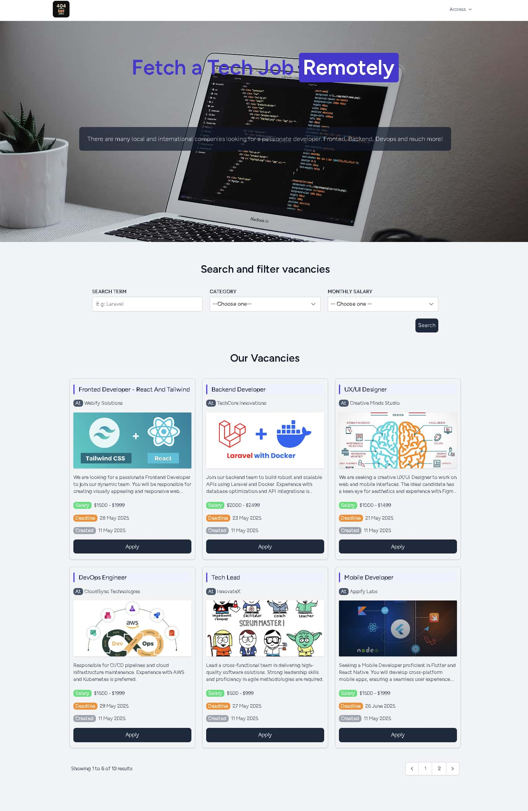
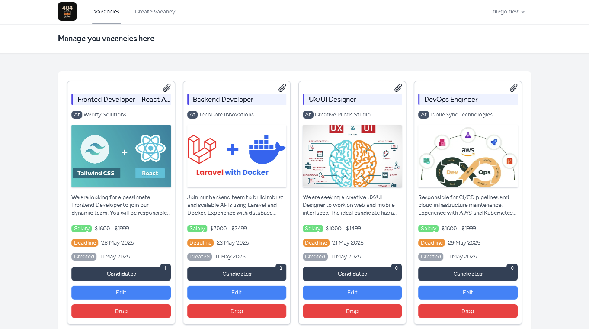
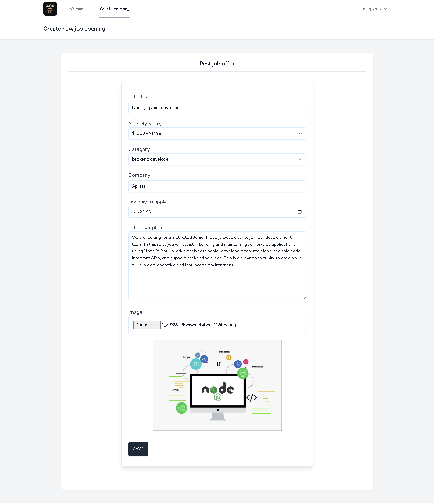

# 404Jobs

404Jobs is a job board platform tailored for the IT industry. It allows recruiters to post job vacancies and developers to find and apply to opportunities that match their skills and preferences.

---

## 🚀 Features

### For Developers

* Browse the latest or filtered IT job vacancies
* Apply to vacancies with a personal CV upload

### For Recruiters

* Create and manage job vacancies
* Specify job details like title, salary, company, description, image, etc.
* Receive and manage applications from developers
* Get notified when new candidates apply

---

## 🛠️ Tech Stack

* **Laravel**
* **Livewire** (for dynamic components and image uploads)
* **Laravel Breeze** (authentication scaffolding)
* **Blade** (template engine)
* **Tailwind CSS** (styling)
* **MySQL** (database)

---

## 👥 User Roles

* **Recruiter**: Can post and manage job vacancies and review developer applications
* **Developer**: Can search for jobs and apply with a CV

---

## 🖼️ Screenshots

### Home Page



### Recruiter Dashboard



### Vacancy Creation Form



---


## 📌 Getting Started

1. Clone the repository
2. Install dependencies and set up your `.env` file
3. Run migrations and seeders

```bash
composer install
npm install && npm run dev
php artisan migrate --seed
```

4. Launch the app

```bash
composer run dev
```

---

## 📄 License

This project is open to the public. Feel free to use and contribute!
